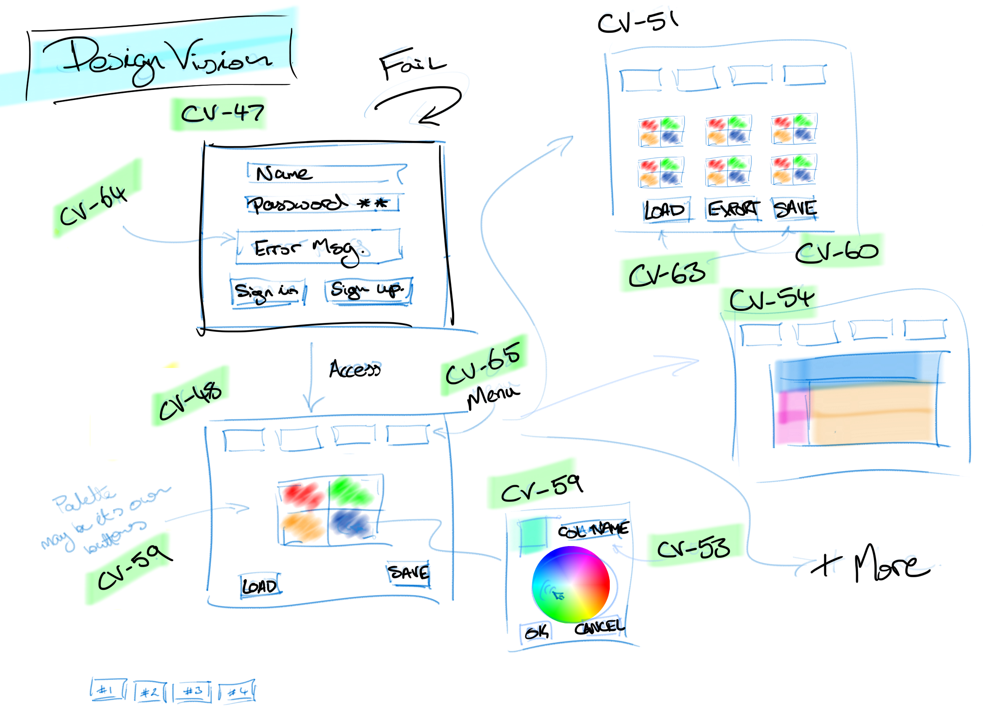
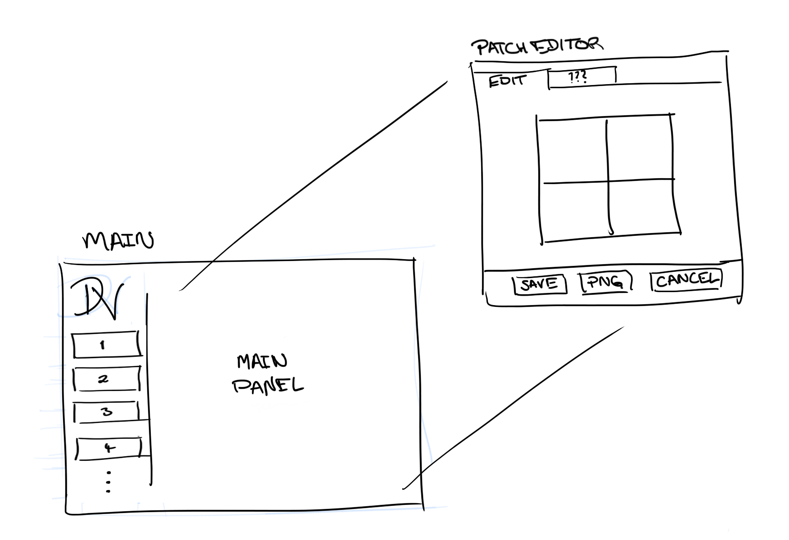
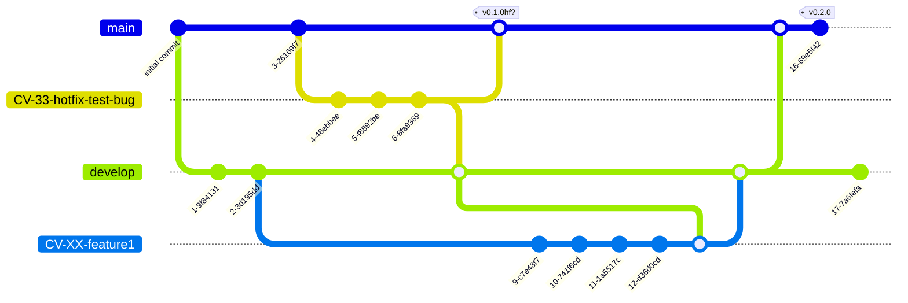

# DesignVision

Inclusive Design Made Easy  
DesignVision is a colour palette design tool focused on empowering designers to create inclusive and accessible digital experiences.

By team CodeVision,  
Queensland University of Queensland - CAB302 - Sem1 2024  
Java application for designers.  
Develop colour pallets with focus on client accessibility and collaboration.

## Team CodeVision

| Name              | int. | Student   | Contact                               |
|-------------------|:----:|-----------|---------------------------------------|
| Aidan  Sulisz     |  AS  | n10479520 | <aidan.sulisz@connect.qut.edu.au>     |
| Alanna Bui-Nguyen |  AB  | n9426825  | <alanna.buinguyen@connect.qut.edu.au> |
| Andrew Phan       |  AP  | n11580267 | <an.phan@connect.qut.edu.au>          |
| Ross   Gordon     |  RG  | n10427791 | <r23.gordon@connect.qut.edu.au>       |
| Yejun  Lee        |  YL  | n11205008 | <yejun.lee@connect.qut.edu.au>        |

## Contents

<!-- TOC -->
* [DesignVision](#designvision)
  * [Team CodeVision](#team-codevision)
  * [Contents](#contents)
  * [Project Description](#project-description)
  * [Terminology](#terminology)
  * [Useful References](#useful-references)
  * [App Layout](#app-layout)
  * [Team Contributors](#team-contributors)
    * [Remote Repository](#remote-repository)
    * [Git Logs txt](#git-logs-txt)
    * [Version Control](#version-control)
<!-- TOC -->

## Project Description

This project aims to provide designers with the tools they need to create interfaces that are usable by everyone, regardless of ability. DesignVision tackles this challenge by:

* Color Palette Creation: Design custom color palettes that consider the needs of users with vision impairments, including low vision and color blindness.
* Real-time Collaboration: Collaborate with clients and stakeholders in real-time to ensure chosen color palettes meet accessibility standards.
* Understanding Visual Difficulty: Gain insights into how specific visuals might be perceived by users with vision impairments through features like image testing.
* Template Testing: Apply color palettes to pre-designed templates to get immediate feedback on accessibility.
* Additional Accessibility Features:
  * Secure login for multiple users.
  * Customizable settings and palettes.
  * Import/export color sets for sharing.
  * Text optimizer for optimal readability.
  * Color blind simulator.
  * "Name this color" functionality to assist vision-impaired users.

DesignVision is evolving with new features and functionalities being explored to further empower inclusive design practices.

This repository holds the source code for the DesignVision application.

## Terminology
| Term                 | Description |
|----------------------| --- |
| Patch                | Colour patch of four(4) colours a user can change, save, load |
| Patch set            | Set of patches a user can view, use and share (import/export) |
| Main Panel           | Area in the main application page that houses all functionality panels |
| Menu                 | Main nagigation buttons down LHS |
| Panel Action Control | Buttons or other user controls within a panel |

## Useful References

* [FXML](https://docs.oracle.com/javase/8/javafx/api/javafx/fxml/doc-files/introduction_to_fxml.html)
* [Maven](https://maven.apache.org/guides/index.html)
* [Mermaid UML](https://mermaid.js.org/)
* [plantUML](https://plantuml.com/)
* [Scene Builder User Guide](https://docs.oracle.com/javase/8/scene-builder-2/user-guide/index.html)
* [JavaFX Docs](https://openjfx.io/javadoc/22/index.html)

## App Layout

Initial concept sketch from user story issue numbers:


GUI planning of Main "Menu" and "Panel" with standardised menu system and example functionality page:


## Team Contributors

DesignVision is a closed project by team members of 'CodeVision', CAB302, QUT  

### Remote Repository

* Project hosted with GitHub under CodeVisionQUT
* GitHub 'Organisation': CodeVisionQUT
  * CodeVisionQUT (the team) owns DesignVision the repository
  * Accessible only by team members
  * All repositories forced private
* GitHub 'Repository': DesignVision
  * Private as CAB302/QUT assessment requirements

### Git Logs txt

Git log snippet (paste into terminal with middle click)

```bash
# New log directory if not exist
mkdir -p ../gitLogs

# Generate txt file log, all branches, fully decorated, file datestamp
git --no-pager log --all --decorate > ../gitLogs/$"`date +"%y%m%d%H%M"`"-log.txt
```

### Version Control

Version control is based on Git-Flow style.



* `main` is current stable version
  * develop is merged into main with version
* `develop` separates feature branches from main.
  * Pull requests merge feature branches into develop 
  * Develop is fully tested and operational before being merged into main.
  * Ideally, this means main is always the stable and current release.
* Feature branches
  * prefixed with the relevant Jira issue key (eg CV-33-<name>)
  * Jira looks for these keys and links to repo
  * Pull request to merge feature into develop, ideally, pre-resolved merge conflicts 
* Commits
  * prefixed with the relevant Jira issue key (not shown in example below)
