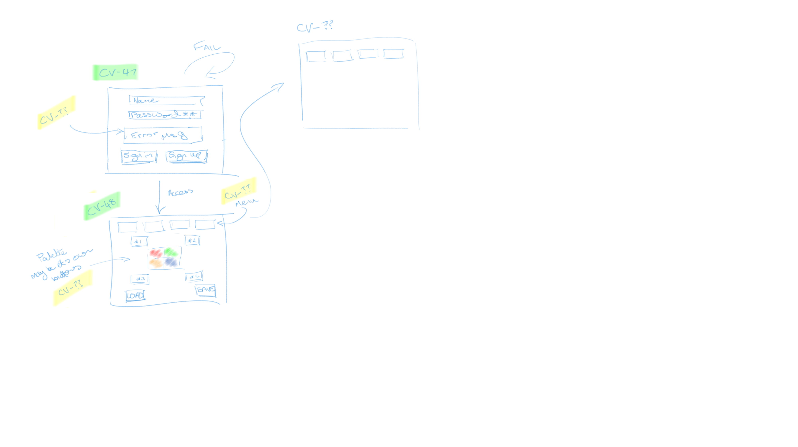
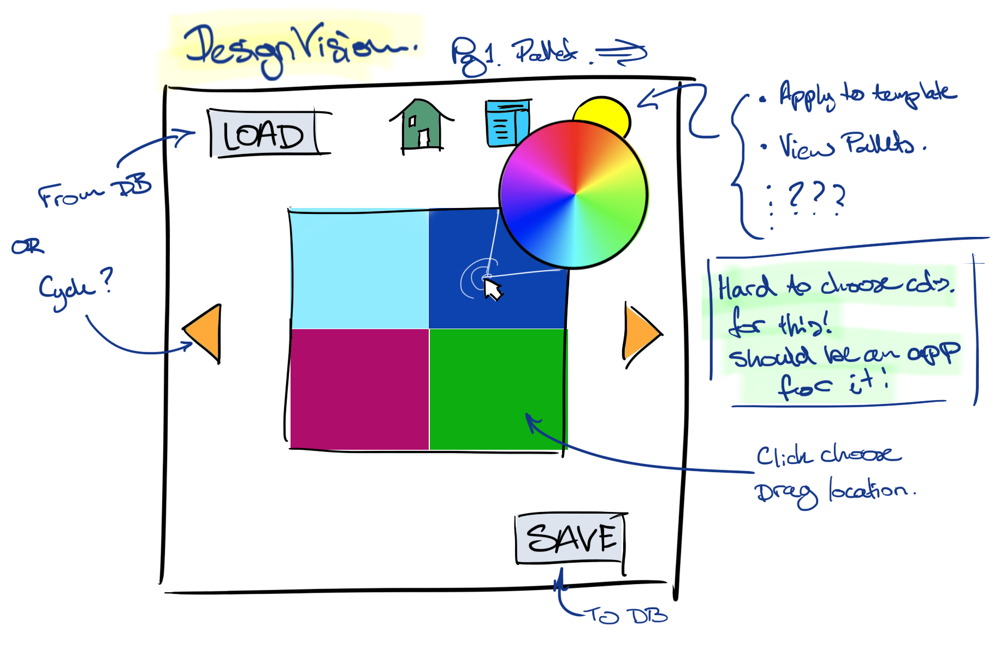

# DesignVision Project Proposal

## Product Vision Statement

Whether crafting a physical space or a digital interface, the designer's journey begins with a focus on inclusivity and accessibility.  This not only benefits the well-being of users by ensuring effective system interaction for all, it fosters awareness and acceptance of diverse abilities.  Digital interface designs should strive for Digital Wellbeing. Additionally, officially renderred textures or graphics furhter lack a focus on inclusivity and accessibility, unfairly disadvantaging users or viewers with vision impairments, when this should be a high priority.

To drive this inclusive design process, tools like DesignVision are invaluable.  This app empowers designers to create custom colour palettes that perfectly suit their clients' specific needs.  It allows for real-time collaboration in choosing colour sets and verifying their effectiveness. Furthermore, it provides designerswith a firm understanding on what elements of visual design provide difficulty to the vision impaired. It does so through collecting data, such as the aforementioned colour palettes, with additional features such as an interactive imagery test.

To assist productive collaboration, DesignVision can apply a palette to various templates to get immediate feedback on how a client perceives the combination.  For example, a low vision person might require specific contrast levels to separate shapes, while a colourblind person may need to avoid certain colours or simply want to explore non-standard palettes.

Alongside the collaboration tools, DesignVision offers a wealth of features to support both designers and their clients.  These can be combined in many ways for a positive, inclusive design process, promoting digital.

DesignVision's Key Features:

- Secure login for multiple users per device
- Custom settings and palettes per user
- Import/export colour sets for sharing
- Templates for palette viewing and verification
- Text optimizer: To ensure optimal font, size, colour and contrast
- Tools for collecting samples from external media
- "Name this colour": Assists colour blind or vision impaired users in identifying colors
- Colour blind simulator: Allows designers to experience colour palettes from a colorblind perspective
- Image testing functionality, displaying select renders for users to comment on with the purpose of highlighting difficulty or ease percieving said renders
- And we are exploring more possibilities for DesignVision to empower inclusive design.

## Objectives and Scope

(WIP) DesignVision Layout Plan:

Very rough draft0.0.001 sketch:

Initial DesignVision Vision:

## Stakeholders

## Requirements

## Personas and User Stories

## Risk and Assumption logs

## Quality assurance and Testing

### Definition of Done (DoD)

### Test Plan and Test Cases
