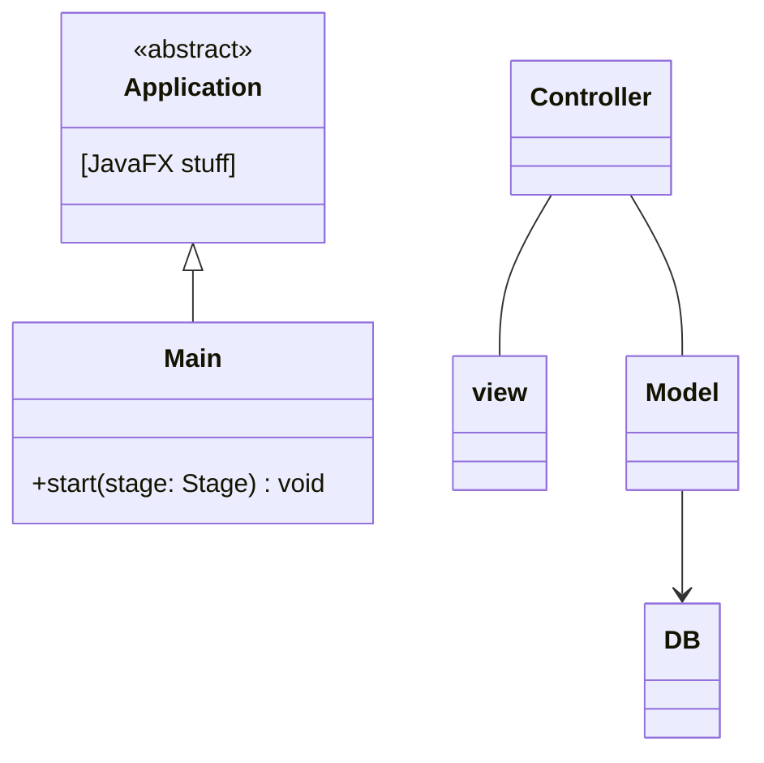

# DesignVision Example MVC Class Diagram

## Main menu and Panels

- One menu button each opens the relevant panel. Panel has its own sub-menu buttons.
- Menu buttons are fixed location at all times.
- Panel buttons are in a consistent location (bottom of panel, so they don't look like tabs?)

Required menu buttons for panels/functionality pages:

1. Account:
    - Panel: This panel would handle login, signup, account information, and potentially password management functionalities (combines elements of CV-47 and user account management).
2. Palette:
    - Panel: (patch?) This panel would be the central hub for managing individual color palettes. Users can view, create, edit, delete, and potentially rename palettes here (CV-49, CV-52, CV-59, CV-53, and basic palette management).

3. Sets:
    - Panel: This panel focuses on managing collections of palettes (sets). Users can create, name, edit, view, export, and import sets of palettes here (CV-51, CV-60, and set management functionalities).

4. Accessibility:
    - Panel: This panel would group functionalities related to accessibility features:
        - Accessibility Testing, written and/or spacial feedback (CV-56, CV-57, and CV-58)
            - TODO: Needs work on requirements.  e.g. its own panel, what heading?
        - Adjusting contrast (CV-24)
        - Simulating colorblind vision (CV-55)
        - Accessibility tips and guidelines (CV-62)

5. Education:
    - Panel: This panel would provide educational resources and user support. It could include:
        - Information about color theory and accessibility
        - Links to helpful websites, tutorials, services, articles, etc
        - User guides and FAQs

## Diagram testing...

