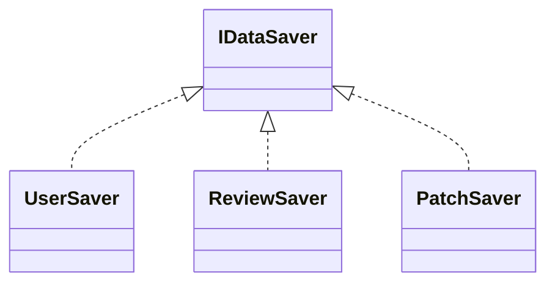
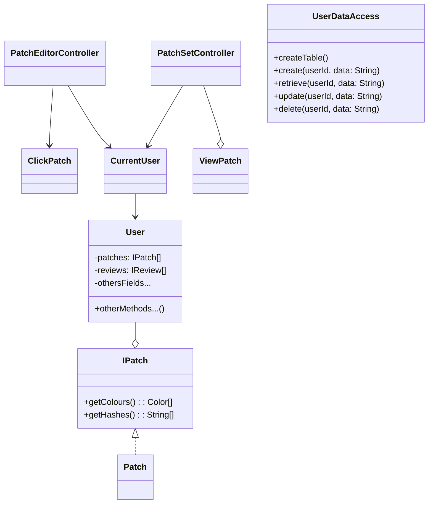
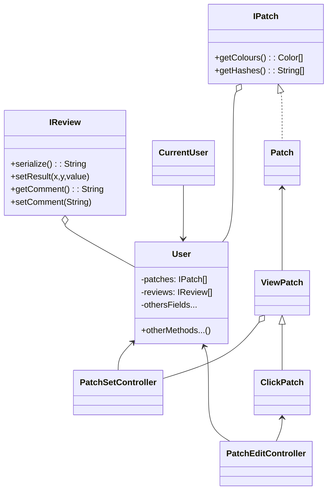

# User Data

## Concept Notes

- "Patch Editor" and "Patch Sets" add/manage Patch list owned by the current user
- "Render Review" add/manage Reviews list owned by current user
- "CurretUser" singleton has method to save off current user data
- "MainController" fires off the CurrentUser save method when a new menu item is clicked
- No other controller needs to be concerned with when/how user data is saved

## DataSaver

- [] Improve names

## User Patches

## Concerned classes and connections

